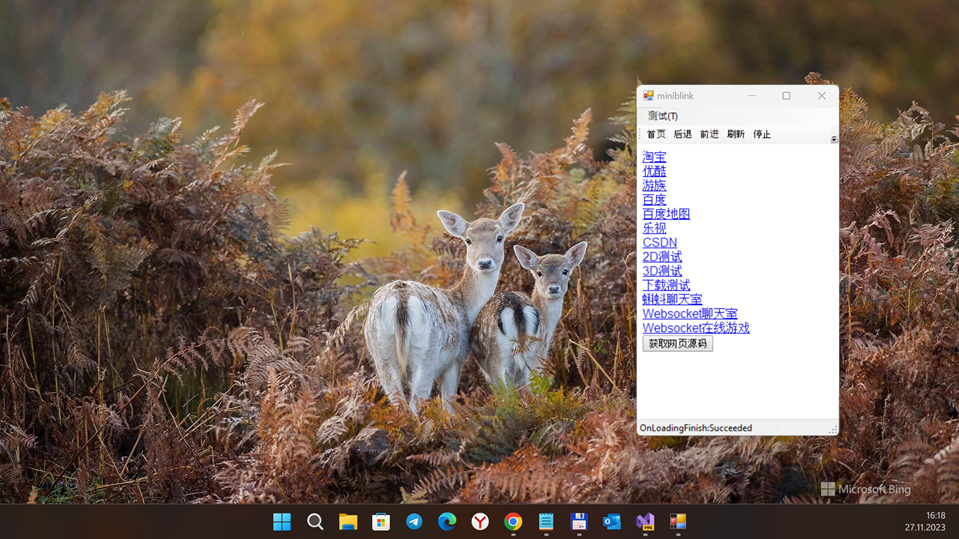
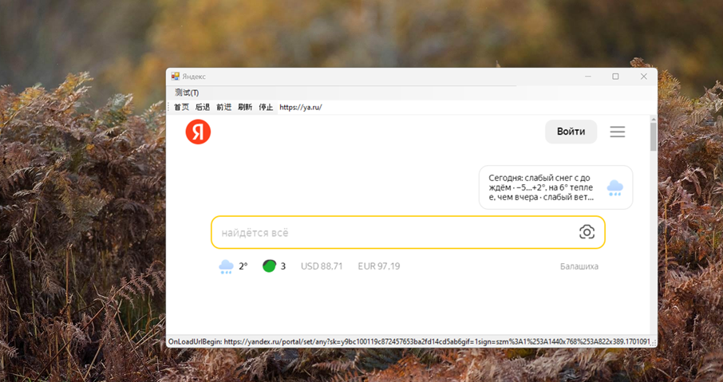

# MiniBlinkNet

## About
My quick and dirty experiment to "call" Chromium-based dll from small and simple C# web-browser project :)
Main goal of my "microtest" is to explore an difficulty of miniblink c++ dll "C# calling" + test some sites "rendering rate" ;) 

## Screenshots

## Tech. details
.Net calls the miniblink developed by the sweeping monk of Longquan Temple, the address：
https://github.com/weolar/miniblink49

It is not encapsulated as a component, but uses the bind method to bind a window or component
See *Demo* project for details.

## Additional Info
For more information, check out miniblink's new official website: https://weolar.github.io/miniblink/

## Dependences & References
- node.dll
- https://gitee.com/kyozy/miniblinknet

## ..
As is. No support. RnD only.

## .
[m][e] 2023

